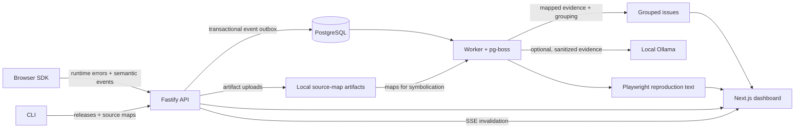
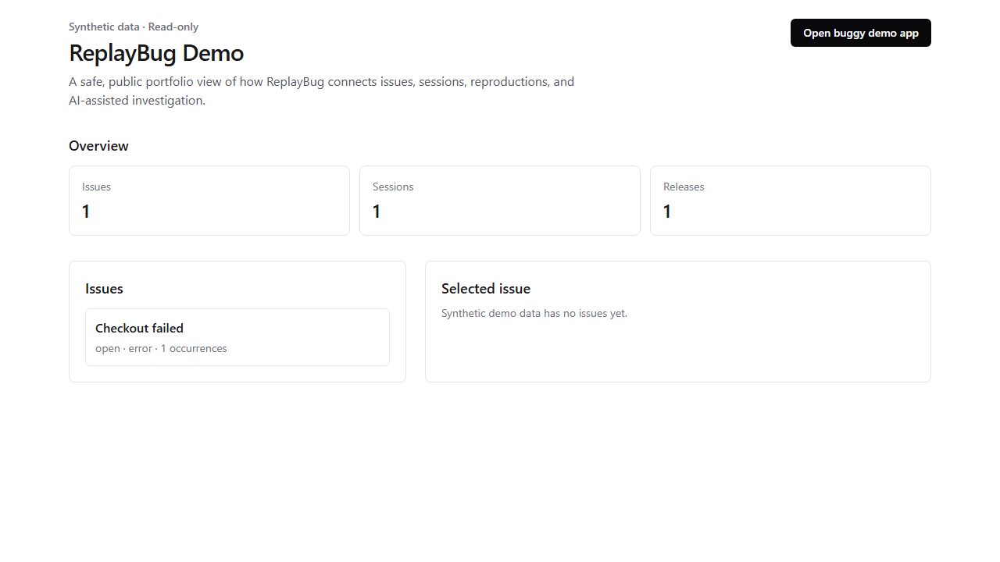

# ReplayBug

**Turn a browser runtime error into evidence a developer can rerun.**

ReplayBug captures privacy-safe browser failure context, groups repeated failures,
shows the semantic timeline that led to an occurrence, maps stacks through uploaded
source maps, and generates a Playwright test from retained evidence. It is designed
for self-hosting with PostgreSQL and a local artifact volume—not paid services.

The synthetic public demo and its local screenshot are portfolio evidence.

## The workflow



1. The SDK records runtime errors, failed requests, navigation, clicks, and other
   bounded semantic context.
2. Ingest validates, redacts, rate-limits, deduplicates, and commits the event and
   its outbox handoff together.
3. The worker symbolicates before deterministic fingerprinting, so repeated failures
   become a grouped issue with source-mapped evidence when artifacts exist.
4. An issue detail links an occurrence to its session timeline; a retained occurrence
   can become a downloadable, developer-run Playwright reproduction.

This is intentionally **not** DOM/video replay. It preserves the smallest useful,
privacy-conscious sequence of events rather than a recording of a user's screen.

## Quick start

Requirements: Node.js 24, pnpm 10, and Docker for PostgreSQL.

```bash
cp .env.example .env                 # PowerShell: Copy-Item .env.example .env
docker compose up -d postgres
pnpm install
pnpm db:migrate
pnpm db:seed                         # development-only tenancy seed
pnpm dev
```

`pnpm dev` starts web, API, worker, and the deliberately buggy demo. Configure the
required URLs, auth secrets, and trusted origins in `.env`; see
[the self-hosting guide](docs/self-hosting.md) for the full environment and Docker
flow. Local email/password auth is available; GitHub OAuth is optional when it is
configured.

## Public synthetic demo

`/demo` is an anonymous **read-only** portfolio view backed by a designated synthetic
demo project. Its API is limited to bounded `GET /api/v1/public-demo/*` responses;
no authenticated route or mutation is reused. It is off unless
`REPLAYBUG_DEMO_MODE=true`.

For the full local demo, start the Docker stack, enable the flag for API, then seed
explicitly:

```bash
export REPLAYBUG_DEMO_MODE=true
docker compose -f docker-compose.full.yml up -d postgres
docker compose -f docker-compose.full.yml --profile migrate run --rm migrate
docker compose -f docker-compose.full.yml up -d api worker web demo
docker compose -f docker-compose.full.yml --profile seed-demo run --rm seed-demo
```

Open `http://localhost:3000/demo`, select a synthetic issue, inspect its occurrence
and timeline, then optionally open the intentionally buggy app. Do not use the
public-demo project for real telemetry. The detailed
[Docker instructions](docker/README.md) and [self-hosting guide](docs/self-hosting.md)
cover URLs, TLS, storage, backup, and reset behavior.



This screenshot is synthetic local evidence captured from the full Docker stack; it does not prove remote CI.

## SDK and CLI

Initialize the current browser SDK with a public ingest DSN. The public key is
browser-visible by design and is restricted to telemetry ingest; do not substitute a
secret CLI token.

```ts
import { init } from "@replaybug/sdk";

init({
  dsn: "https://rb_pk_<public-ingest-key>@api.example.com/api/ingest/v1",
  environment: "production",
  release: "web@1.4.2",
  captureSafeInputs: false, // default: input values are not captured
});
```

Release automation uses a project-scoped secret token only through
`REPLAYBUG_AUTH_TOKEN`—there is deliberately no `--token` flag:

```bash
pnpm build # once; the CLI runs from its built dist/
export REPLAYBUG_AUTH_TOKEN='rb_sk_<redacted>'
node packages/cli/bin/replaybug.js projects info
node packages/cli/bin/replaybug.js releases create 'web@1.4.2' --commit-sha 9f3c2ab1
node packages/cli/bin/replaybug.js sourcemaps upload ./dist --release 'web@1.4.2'
```

See the [CLI reference](docs/cli.md), [credential-separation ADR](docs/adr/0002-public-ingest-key-versus-secret-token-separation.md), and [source-map design](docs/architecture/source-maps.md).

## What a generated reproduction looks like

ReplayBug renders code; it does not execute a customer's site. A developer reviews
and runs the downloaded test locally. The following is representative generated
Playwright output: it uses a semantic locator, asserts the captured failure, and
keeps sensitive input as a required placeholder.

```ts
import { expect, test } from "@playwright/test";

test("reproduces captured issue", async ({ page }) => {
  const pageErrors: string[] = [];
  page.on("pageerror", (error) => pageErrors.push(error.message));

  await page.goto("http://localhost:5173/");
  await page.getByTestId("demo-uncaught-error").click();
  await page.getByLabel("Email").fill("REPLACE_WITH_TEST_VALUE");

  await expect
    .poll(() =>
      pageErrors.some((message) =>
        message.includes("DEMO: Uncaught error after navigation and click"),
      ),
    )
    .toBe(true);
});
```

Locator preference is `test_id`, role/name, label, id, name, then a warned CSS
fallback. Navigation is reduced to safe same-origin routes, and sensitive values are
redacted before rendering. Details: [reproduction generator](docs/architecture/reproduction-generator.md).

## Privacy, governance, and retention

- Input-value capture is opt-in; password, token, card-like, and marked values are
  redacted. Server-side sanitization is a second boundary.
- Workspaces use owner/admin/member/viewer roles, audit sensitive governance actions,
  and keep public ingest keys, secret CLI tokens, and dashboard sessions separate.
- Project retention is 7–365 days. Bounded worker cleanup removes eligible raw events
  while preserving lifetime issue aggregates; confirmed project/workspace deletion
  queues local artifact deletion durably.
- Optional local Ollama analysis receives a bounded sanitized evidence bundle and
  stores only validated, hypothesis-labeled output. It is disabled unless an operator
  configures both URL and model; core processing never requires it.

Read [tenancy and retention](docs/architecture/tenancy.md),
[optional local AI](docs/architecture/ai-analysis.md), and the
[privacy-defaults ADR](docs/adr/0005-privacy-safe-input-defaults.md).

## Testing and proof

Run focused local checks as appropriate:

```bash
pnpm format:check
pnpm lint
pnpm typecheck
pnpm test
pnpm api:check
pnpm build
pnpm test:e2e
pnpm test:browser-compat
pnpm verify:generated-test
pnpm benchmark:ingest
```

The [acceptance map](docs/acceptance.md) connects the master Definition of Done to
commands, routes, and documentation. [Performance notes](docs/performance.md) describe
the self-contained local benchmark and record only actual measured output. The configured
[GitHub Actions workflow](.github/workflows/ci.yml) defines format, lint, typecheck,
test, build, OpenAPI, E2E, browser-compatibility, size, and dependency-audit gates.

## Architecture and operations

- [Architecture overview](docs/architecture.md)
- [Dashboard](docs/architecture/dashboard.md) · [frontend](docs/architecture/frontend.md) · [realtime SSE](docs/architecture/realtime.md)
- [Fingerprinting](docs/architecture/fingerprinting.md) · [worker/outbox](docs/architecture/worker.md) · [source maps](docs/architecture/source-maps.md)
- [Reproduction generator](docs/architecture/reproduction-generator.md) · [tenancy/governance](docs/architecture/tenancy.md) · [optional AI](docs/architecture/ai-analysis.md)
- [CLI](docs/cli.md) · [self-hosting](docs/self-hosting.md) · [full Docker stack](docker/README.md)
- [ADRs](docs/adr/README.md) · [master specification]() · [acceptance map](docs/acceptance.md) · [performance](docs/performance.md)

## Trade-offs and non-goals

ReplayBug favors explainable, privacy-safe evidence over video/DOM replay. It has no
Redis, mandatory object store, paid service, hosted execution, billing, SSO, SMTP,
remote source-map fetches, hosted/paid LLM provider, automatic fixes, or arbitrary
customer Playwright execution. Artifact storage is local-first and single-node today;
the storage seam leaves room for a future backend without making one required.

## Project status

The current `feat/final-portfolio` branch contains the portfolio/demo work locally.
The repository has a GitHub Actions workflow, but remote Actions have **not** run for
this unpushed branch; that is the only remote proof still pending. See
[docs/acceptance.md](docs/acceptance.md) for the explicit proof map.

## License

[MIT](LICENSE) © ReplayBug Contributors.
